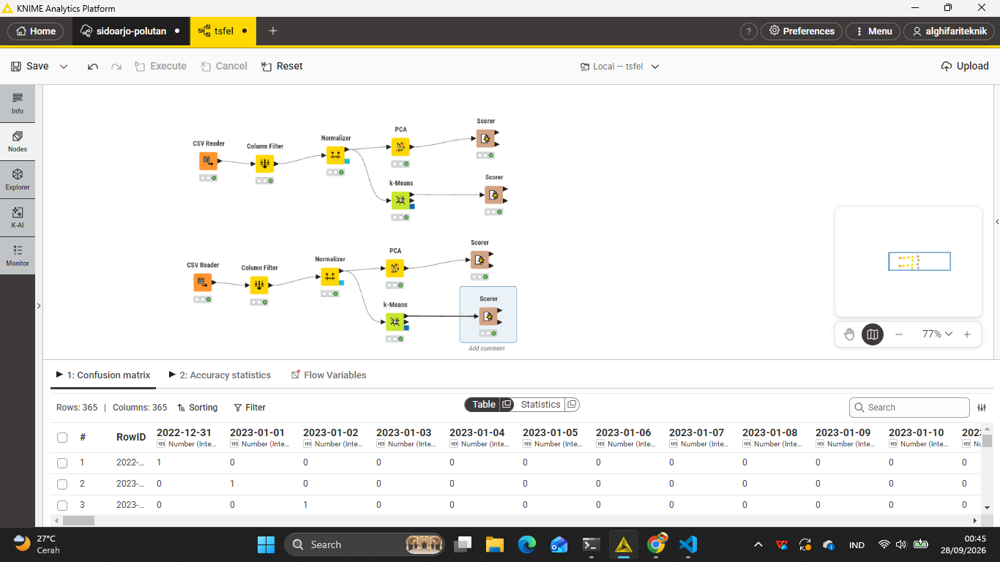

# 5.5 Implementasi Workflow KNIME Analytics Platform

Dokumen ini menjelaskan rancangan, diagram visual, dan konfigurasi **workflow KNIME Analytics Platform** untuk mereplikasi tahapan **Reduksi Dimensi PCA (1 - 37 Komponen)** dan **K-Means Clustering** secara visual tanpa kode (*low-code/no-code*) untuk polutan individu ($\text{NO}_2$, $\text{SO}_2$, $\text{CO}$) dan gabungannya di Kecamatan Wonoayu.

---

## 1. Arsitektur & Tangkapan Layar Workflow KNIME

Berikut adalah tangkapan layar resmi (*screenshot*) rancangan workflow yang telah dikembangkan dan dieksekusi pada kanvas KNIME Analytics Platform:


> **Panduan Gambar (`assets/knime-workflow-5.5.png`):** Tangkapan layar kanvas workflow KNIME yang menampilkan alur komprehensif ekstraksi masukan data 68 fitur TSFEL, normalisasi Z-score (`Normalizer`), reduksi dimensi PCA 37 komponen (`PCA Compute` & `PCA Apply`), pemodelan `k-Means Clustering`, pewarnaan klaster (`Color Manager`), hingga visualisasi sebaran data 2D/3D (`Scatter Plot` & `3D Scatter Plot`).

---

## 2. Diagram Alur Pemrosesan Data di KNIME

Alur pemrosesan data pada kanvas KNIME Analytics Platform secara skematis dirancang sebagai berikut:

```
┌─────────────────┐      ┌─────────────────┐      ┌─────────────────┐
│   CSV Reader    │ ───► │   Normalizer    │ ───► │   PCA Compute   │
│ (68 Fitur TSFEL)│      │  (Z-Score Norm) │      │  (37 Komponen)  │
└─────────────────┘      └─────────────────┘      └────────┬────────┘
                                                           │
                                                           ▼
┌─────────────────┐      ┌─────────────────┐      ┌─────────────────┐
│  Scatter Plot   │ ◄─── │  Color Manager  │ ◄─── │     k-Means     │
│  (Visualisasi)  │      │(Cluster Colors) │      │  (K=4 Clusters) │
└─────────────────┘      └─────────────────┘      └─────────────────┘
```

---

## 3. Panduan Setup & Detail Konfigurasi Setiap Node KNIME

### A. Node `CSV Reader`
- **Fungsi**: Memuat berkas dataset matriks 68 fitur TSFEL (`SO2_Wonoayu_TSFEL.csv`, `CO_Wonoayu_TSFEL.csv`, `NO2_Wonoayu_TSFEL.csv`, atau data 1 Kelas).
- **Pengaturan**:
  1. Tentukan lokasi berkas CSV masukan.
  2. Centang opsi *Has Column Header*.
  3. Pastikan seluruh kolom fitur terdeteksi sebagai tipe data `Number (double)`.

### B. Node `Normalizer`
- **Fungsi**: Mengubah skala seluruh 68 fitur ke rentang terstandar (*Z-Score Normalization* / Mean = 0, Std = 1) untuk mencegah dominasi variabel dengan skala magnitudo besar.
- **Pengaturan**:
  1. Masukkan seluruh 68 kolom numerik pada daftar *Include Columns*.
  2. Pilih metode *Z-Score Normalization (Gaussian)*.

### C. Node `PCA Compute` & `PCA Apply`
- **Fungsi**: Menghitung matriks kovarians dan memproyeksikan data dari 68 fitur TSFEL ke **37 Komponen Utama (PCA 1 - PCA 37)**.
- **Pengaturan**:
  1. Pilih target reduksi berbasis jumlah komponen: **37 Komponen** (untuk combined) atau komponen individual.
  2. Centang opsi *Output Cumulative Variance* (mempertahankan $\approx 100\%$ varians data).

### D. Node `k-Means`
- **Fungsi**: Menjalankan algoritma K-Means Clustering pada data hasil proyeksi 37 komponen PCA.
- **Pengaturan**:
  1. Set *Number of Clusters ($k$)* = **4** (untuk Combined 3 Polutan) atau **2** (untuk data 1 Kelas / polutan individu).
  2. Set *Max number of iterations* = **100**.
  3. Set *Initialization method* = **k-Means++** / Random dengan fixed seed.

### E. Node `Color Manager` & `Scatter Plot`
- **Fungsi**: Memberikan skema warna unik untuk masing-masing klaster dan menampilkan sebaran data 2D pada sumbu `PCA_1` vs `PCA_2`.

---

## 4. Tautan Notebook Interaktif & Kode Python

Seluruh eksekusi kode Python, visualisasi Scree Plot, Heatmap Silhouette Score, dan perbandingan performa dapat dijalankan secara langsung melalui berkas notebook Jupyter:

📥 **Tautan Berkas Notebook**: [`05_kmeans_clustering.ipynb`](05_kmeans_clustering.ipynb)  
📥 **Tautan Notebook Data 1 Kelas**: [`5.7_clustering_satu_kelas.ipynb`](5.7_clustering_satu_kelas.ipynb)

